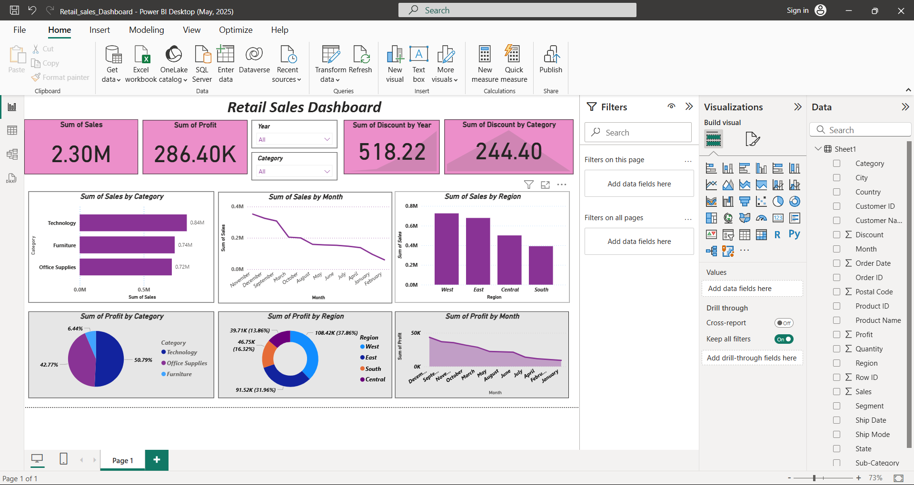

# 🛍️ Retail Sales Analysis Dashboard

## 📖 Project Overview
Developed an interactive **Retail Sales Dashboard** using **Python** and **Power BI** to analyze sales performance, profit trends, and regional insights for data-driven business decisions.  
This project showcases end-to-end data analysis — from data cleaning and preprocessing in Python to building an interactive dashboard for retail performance visualization.

---

## 🧰 Tools & Technologies Used
- **Python** (Pandas, Matplotlib, Seaborn) → Data Cleaning & Preprocessing  
- **Power BI** → Dashboard & Visualization  
- **Excel** → Data Verification & Export  
- **Dataset:** Superstore Retail Sales Data (~10,000 records)

---


### Install Required Libraries

```
pip install pandas matplotlib seaborn openpyxl
```


## ⚙️ Project Workflow

### 🔹 Step 1: Data Cleaning (Python)
- Loaded dataset using Pandas  
- Handled missing values and duplicates  
- Converted dates and extracted Month/Year columns  
- Generated a cleaned dataset for Power BI

### 🔹 Step 2: Data Analysis
- Calculated Total Sales, Profit, and Discount  
- Explored Sales by Category, Region, and Month  
- Exported clean dataset as `Cleaned_Retail_Sales.xlsx`

### 🔹 Step 3: Visualization (Power BI)
Built an interactive dashboard with:
- **KPI Cards:** Total Sales, Total Profit, Discount  
- **Bar Chart:** Sales by Category  
- **Line Chart:** Monthly Sales Trend  
- **Column Chart:** Sales by Region  
- **Pie/Donut Charts:** Profit by Category & Region  
- **Slicers:** Year and Category filters

---

## 📊 Dashboard Preview


---

## 📈 Key Insights
- 💻 **Technology** category contributes the highest sales (~0.84M).  
- 🌍 **West Region** generates the most revenue and profit.  
- 🪑 **Furniture** has moderate sales but a higher discount rate.  
- 📅 **December** records the peak monthly sales due to holiday demand.  
- 💰 Overall Sales: **2.3M**, Total Profit: **286K**.

---

## 📂 Project Files
| File | Description |
|------|--------------|
| `Retail_sales.csv` | Raw dataset |
| `retail_sales_analysis.py` | Python data cleaning & analysis script |
| `Cleaned_Retail_Sales.xlsx` | Processed dataset for Power BI |
| `Retail_Sales_Dashboard.pbix` | Power BI Dashboard file |
| `README.md` | Project documentation |
---
## Conclusion

The Retail Sales Analysis Dashboard project provides a complete overview of sales performance and business insights.
By combining Python for data cleaning and analysis with Power BI for visualization, this project empowers businesses to:
- Identify top-performing categories and regions
- Understand seasonal trends and sales fluctuations
- Optimize pricing, discounts, and inventory management
- Make data-driven strategic decisions to boost profitability

This project demonstrates how effective data analytics can transform raw data into meaningful insights that support better retail strategy and performance.


